## 🤖 SelfDriveSuite: Vehicle Control and Scene Understanding                                                               
Note:  This project is a culmination of my work for the **"ROB 535: Self-driving Cars: Perception to Control"** course, conducted from September to December 2023. The course provided a solid foundation in autonomous driving technologies, from perception to control, and this repository represents the integration and application of those concepts.
<!-- 

      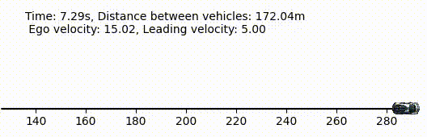

 -->
<!-- 

    

        
    

    

        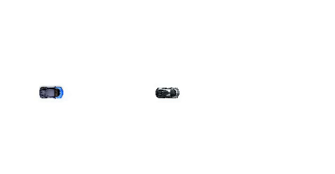
    

 -->

  
  
  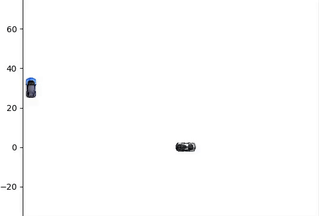
  

### 🎯 Goal
This a comprehensive project focused on developing algorithms for self-driving cars. This repository encompasses several critical components of autonomous driving technology, including:

- **Adaptive Cruise Control**: Implementing an adaptive cruise controller to maintain safe following distances and speeds.
- **Model Predictive Control (MPC)**: Designing both linear and non-linear MPC for tracking reference trajectories and optimizing vehicle paths.
- **All-Weather Scene Understanding**: Achieving robust real-time, object recognition, detection, and scene segmentation in challenging conditions, such as low visibility, and/pr fast-paced scenario, and/or adverse weather.

## ⚙️ Prerequisites
- Libraries/Frameworks:
    - Numpy
    - Matplotlib
    - Scipy
    - CVXPY (for Convex optimization)
    - CasADi 
    - pytorch

## 🛠️ Test/Demo
- Adaptive Cruise Control
    - Go to the directory 'Vehicle Control\Adaptive Cruise Control', and launch the jupyter notebook
- Trajectory tracking using Linear MPC
    - Go to the directory 'Vehicle Control\Trajectory tracking', and launch the jupyter notebook
- Car Overtaking using Non-Linear MPC
    - Go to the directory 'Trajectory Optimization\CarOvertaking', and launch the jupyter notebook
- Drag Racing using Non-Linear MPC
    - Go to the directory 'Trajectory Optimization\DragRacing', and launch the jupyter notebook
- Image Classification
    - Go to the directory 'Image Classification', and launch the jupyter notebook
- Object Detection
    - Go to the directory 'Object Detection', and run 'inference.py' or 'inference_video.py' following README there.
- Scene Segmentation
    - Go to the directory 'Scene Segmentation', and launch the jupyter notebook

## 📊 Results
### 📈 Adaptive Cruise Control

      

      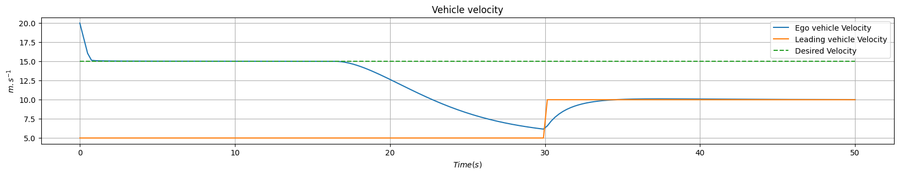

### 📈 Trajectory tracking (using Linear MPC)

      

### 📈 Car Overtaking (using Non-Linear MPC)

      

      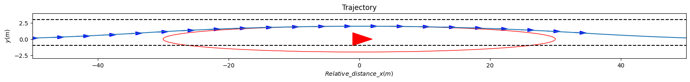

### 📈 Drag Racing (using Non-Linear MPC)
- Case 1:

      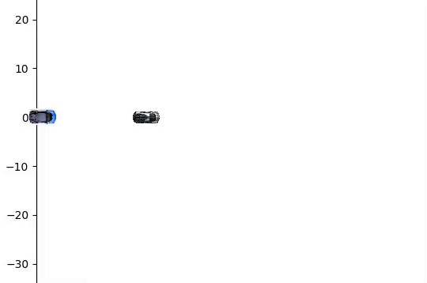

      

- Case 2:

      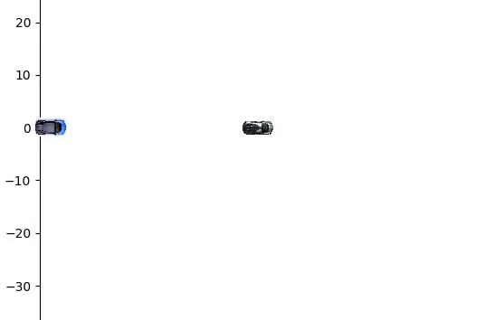

      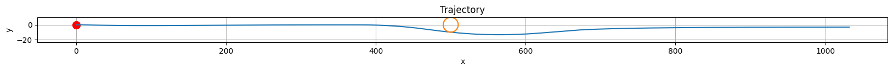

- Case 3:

      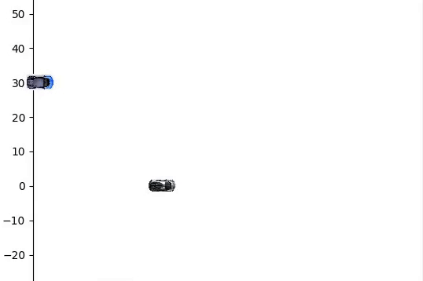

      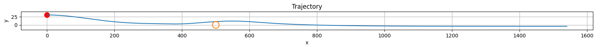

- Case 4:

      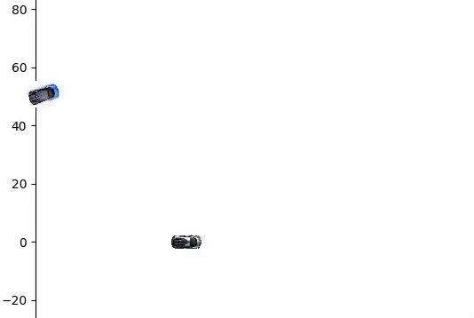

      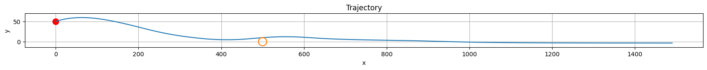

- Case 5:

      

      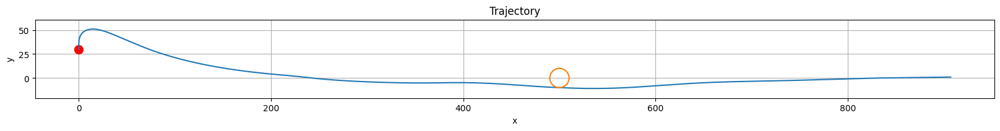

### 📈 Image Classification (Cars vs Person vs None)
- Challenging because low-resolution 32x32 blurry RGB images...still achieved 90% accuracy

      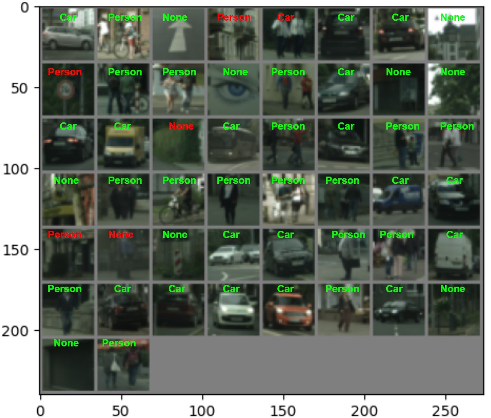

### 📈 Object Detection (Traffic sign Detection)
- Achieved ~48 mAP with an average FPS of 43

      

### 📈 Scene segmentation (Comprising 14 classes from urban scenario + background class)
- Achieved 81.2 mIoU

  
  

